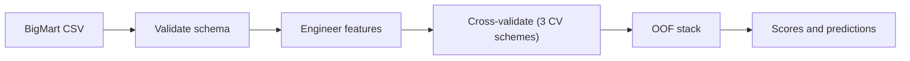
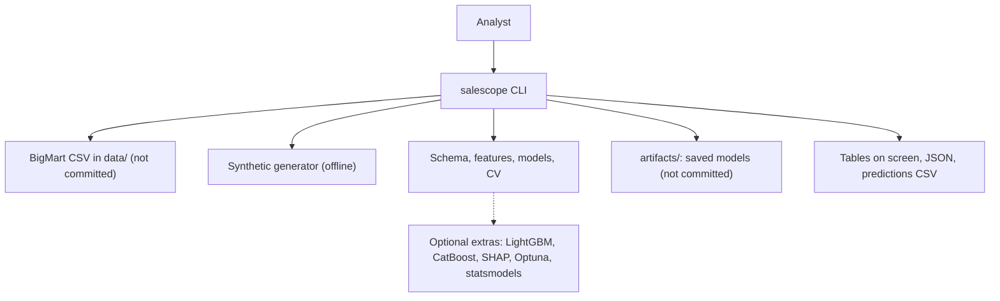
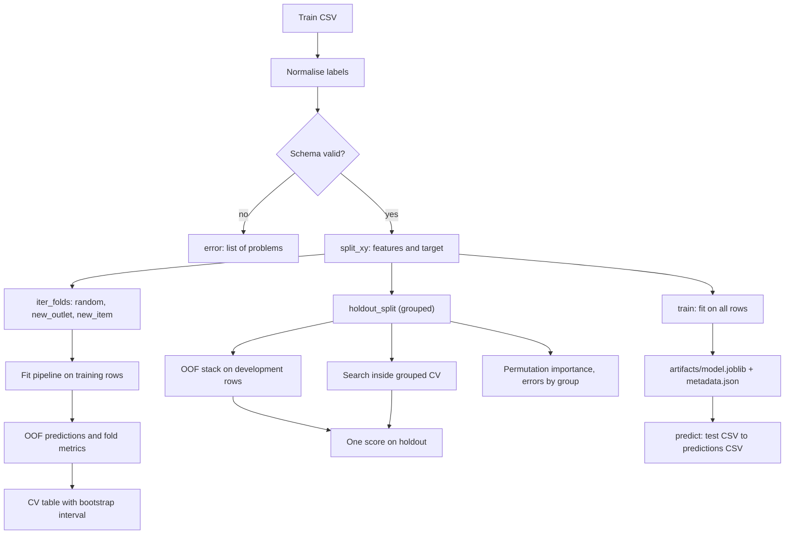

<div align="center">

# salescope — Honest Retail Sales Prediction for BigMart

**salescope is a sales prediction toolkit for analysts who work with item-outlet retail data. It takes a BigMart-style CSV through these steps to a cross-validated sales model and a scored test file:**

`validate` → `engineer features` → `cross-validate by outlet and item` → `stack out-of-fold` → `explain` → `predict`.


**[Summary](#1-summary)** ·
**[Workflow](#4-the-end-to-end-workflow)** ·
**[Run it](#17-how-to-run-salescope)** ·
**[Configuration](#174-environment-variables)** ·
**[Known problems](#20-known-problems)** ·
**[Glossary](#22-glossary)**

</div>

> [!NOTE]
> This README uses ASD-STE100 Simplified Technical English. The writing rules and the project
> vocabulary are in [`docs/ste-style-guide.md`](docs/ste-style-guide.md). Each term in the
> [Glossary](#22-glossary) has only one meaning.

---

salescope predicts `Item_Outlet_Sales` for each item-outlet pair of the public BigMart sales data.
It treats BigMart as cross-sectional regression, because the data has no dates.
Each score comes from rows that the model did not see, under three CV schemes: random rows, new outlets and new items.
Forecasting is a separate track. It accepts only data with real timestamps and uses a rolling-origin backtest.

This README is the **one location that explains all of salescope**. It gives these topics:

- the general design
- each component and its procedure, step by step
- the decision rules
- the data map
- the runbook
- the validation results and the known problems

| If you are… | Read |
|---|---|
| A manager or reviewer | [1](#1-summary), [3](#3-design-rules), [4](#4-the-end-to-end-workflow), [19](#19-validation-results), [21](#21-key-points) |
| A developer who joins the project | All sections, in sequence. Keep [17](#17-how-to-run-salescope) and [20](#20-known-problems) open while you work |
| An operator who runs salescope | [17](#17-how-to-run-salescope), then the section for the component that you use |

---

## Table of contents

1. 🧭 [Summary](#1-summary)
2. 🏗️ [How salescope is built](#2-how-salescope-is-built)
   - 2.1 [Components](#21-components)
   - 2.2 [System context](#22-system-context)
   - 2.3 [Repository layout](#23-repository-layout)
3. 🛡️ [Design rules](#3-design-rules)
4. 🔄 [The end-to-end workflow](#4-the-end-to-end-workflow)
   - 4.1 [Full flow](#41-full-flow)
   - 4.2 [The life cycle of one model run](#42-the-life-cycle-of-one-model-run)
5. 🔵 [The schema and the loader](#5-the-schema-and-the-loader)
6. 🟢 [Feature engineering](#6-feature-engineering)
7. 🟣 [The model registry](#7-the-model-registry)
8. 🧪 [The CV schemes](#8-the-cv-schemes)
9. 📏 [Evaluation and metrics](#9-evaluation-and-metrics)
10. 🧱 [Out-of-fold stacking](#10-out-of-fold-stacking)
11. 🎛️ [Hyperparameter search](#11-hyperparameter-search)
12. 🔍 [Explainability and error analysis](#12-explainability-and-error-analysis)
13. 📈 [The forecast track](#13-the-forecast-track)
14. 🖥️ [CLI and saved models](#14-cli-and-saved-models)
15. ⚖️ [The decision rules](#15-the-decision-rules)
16. 🗂️ [Data and file map](#16-data-and-file-map)
17. ▶️ [How to run salescope](#17-how-to-run-salescope)
    - 17.1 [Prerequisites](#171-prerequisites) · 17.2 [Installation](#172-installation) · 17.3 [Run salescope](#173-run-salescope) · 17.4 [Environment variables](#174-environment-variables)
18. 🧩 [How to extend salescope](#18-how-to-extend-salescope)
19. ✅ [Validation results](#19-validation-results)
20. ⚠️ [Known problems](#20-known-problems)
21. 📌 [Key points](#21-key-points)
22. 📖 [Glossary](#22-glossary)
23. 📄 [License](#23-license)

---

## 1. Summary

**The problem.** A retailer wants to know the sales of each item in each outlet. These questions are difficult:

- How do you repair the known data problems without leakage from the test rows?
- How good is a model for an outlet or an item that it did not see?
- How do you combine models without a score on the rows that trained the combination?
- How do you forecast when the data has no dates?

salescope gives each of these questions its own component. Each component has a test that proves the rule.

| Item | Value |
|---|---|
| Input | A BigMart-style CSV (12 columns), or SYNTHETIC data that `salescope synth` makes |
| Output | CV tables, a stack report, an importance table, a saved model and a predictions CSV |
| Components | **15** modules: config, schema, data, synthetic, features, models, splits, metrics, evaluate, stacking, tuning, explain, forecast, persistence, cli |
| Models | `mean`, `mrp_baseline`, `ridge`, `random_forest`, `hist_gbm`. Optional: `lightgbm`, `catboost` |
| Offline mode | All commands. The demo and the tests use only synthetic data. No key and no network |
| Safety | The feature transformer refuses the target column. Grouped folds refuse a shared group. The forecast track refuses data without dates |
| Tests | **70** unit tests pass, **5** skip without the optional extras (`pytest`) |



---

## 2. How salescope is built

### 2.1 Components

| Component | Module | Purpose |
|---|---|---|
| Settings | `src/salescope/config.py` | Environment variables and a local `.env` loader |
| Schema | `src/salescope/schema.py` | Column contract and a validator that lists each problem |
| Loader | `src/salescope/data.py` | Read a CSV, normalise labels, validate, separate the target |
| Synthetic data | `src/salescope/synthetic.py` | BigMart-like train and test frames with the same quirks |
| Features | `src/salescope/features.py` | `BigMartFeatures`: imputation and domain features, fitted on training rows only |
| Model registry | `src/salescope/models.py` | Full pipelines for 7 models, non-negative predictions |
| CV schemes | `src/salescope/splits.py` | Random, new-outlet and new-item folds, grouped holdout |
| Metrics | `src/salescope/metrics.py` | RMSE, RMSLE, MAE, R² and a bootstrap interval |
| Evaluation | `src/salescope/evaluate.py` | Cross-validation with OOF predictions and train metrics kept apart |
| Stacking | `src/salescope/stacking.py` | OOF stacking with index alignment and a grouped holdout |
| Tuning | `src/salescope/tuning.py` | Random search (or Optuna) inside grouped CV |
| Explainability | `src/salescope/explain.py` | Permutation importance, errors by group, optional SHAP |
| Forecast track | `src/salescope/forecast.py` | Date checks, 4 forecasters, rolling-origin backtest |
| Saved models | `src/salescope/persistence.py` | `joblib` model plus a metadata JSON with a data fingerprint |
| CLI | `src/salescope/cli.py` | The `salescope` command with 10 subcommands |

### 2.2 System context



### 2.3 Repository layout

```
salescope/
├── .github/workflows/ci.yml     # CI: Python 3.11, pip install -e ".[dev]", pytest -q
├── .env.example                 # the 5 environment variable names, no values
├── pyproject.toml               # package, extras (boost, explain, forecast, tune, dev), salescope script
├── data/README.md               # source, terms, columns and download steps (no data committed)
├── docs/ste-style-guide.md      # writing rules and project vocabulary
├── src/salescope/
│   ├── config.py  cli.py               # settings and the command line
│   ├── schema.py  data.py              # column contract, loader
│   ├── synthetic.py                    # offline BigMart-like data
│   ├── features.py  models.py          # feature transformer, model registry
│   ├── splits.py  metrics.py           # CV schemes, regression metrics
│   ├── evaluate.py  stacking.py        # cross-validation, OOF stacking
│   ├── tuning.py  explain.py           # hyperparameter search, importance
│   ├── forecast.py                     # forecast track for dated series
│   └── persistence.py                  # saved models with metadata
└── tests/                              # 75 tests (70 run in CI, 5 need extras), synthetic data only
```

---

## 3. Design rules

### 3.1 No invented time axis
BigMart has no dates. salescope never makes dates from the row order. `forecast.require_real_dates` refuses a frame with the BigMart columns and no date column, and it refuses dates that do not parse.

### 3.2 Fold-local preprocessing
`BigMartFeatures` learns the item weights, the item visibility means and the outlet sizes in `fit`. The transformer is the first step of each pipeline. Thus each fold fits these statistics on its training rows only.

### 3.3 The target never reaches the features
`BigMartFeatures` raises `LeakageError` if the frame contains `Item_Outlet_Sales`. `data.split_xy` removes the target before each fit.

### 3.4 Identifiers are lookup keys, not features
`Item_Identifier` and `Outlet_Identifier` find the item and outlet statistics. They do not become one-hot columns. The item category comes from the first two letters of the identifier.

### 3.5 Each score comes from rows that the model did not see
`evaluate.cross_validate` predicts each row once, in the fold that excludes it. Train-fold metrics have the label `train` and stay in their own column.

### 3.6 Grouped folds keep an outlet or an item in one fold
`new_outlet` and `new_item` put each group in exactly one test fold. `assert_group_isolation` runs on each fold and raises `GroupIsolationError` if a group is in both parts.

### 3.7 The meta-model learns only from OOF predictions
`stacking.stack_evaluate` fits the meta-model on OOF predictions of the development rows. It scores the stack once on a grouped holdout. `align_predictions` joins the base-model predictions by row index.

### 3.8 Problems of the earlier prototype and their fixes

| # | Problem in the earlier prototype | Fix in salescope | Test |
|---|---|---|---|
| 1 | Dates made from the row order, then lags, LSTM windows and SARIMA on them | No date synthesis. The forecast track needs real dates | `test_bigmart_frame_is_refused` |
| 2 | Meta-model fitted and scored on the same rows | OOF meta-model, one score on a grouped holdout | `test_meta_model_never_sees_holdout_rows` |
| 3 | Stack inputs from different outlet-months on one row | Predictions joined by index. Other rows raise `AlignmentError` | `test_align_predictions_*` |
| 4 | LSTM on sequences of length 1, scored on training rows | No fake sequence model. Each score is out-of-fold | `test_cv_oof_covers_every_row_and_keeps_train_metrics_apart` |
| 5 | Median-split "accuracy" and ROC from hard labels | Only RMSE, RMSLE, MAE and R² | `test_report_has_only_regression_metrics` |
| 6 | Zero visibility, missing weight and size ignored, 1,559 one-hot item columns | `BigMartFeatures` repairs each quirk. No identifier columns | `tests/test_features.py` |
| 7 | Random split only | Three CV schemes, with group checks | `test_grouped_folds_never_share_a_group` |
| 8 | One split, default parameters, deprecated arguments | 5-fold CV with mean and spread, search inside grouped CV | `test_tuning_picks_params_from_space_and_scores_holdout` |
| 9 | Hard-coded local paths, cell order matters | Settings from environment variables, a CLI and relative paths | `tests/test_cli_and_config.py` |

---

## 4. The end-to-end workflow

### 4.1 Full flow



### 4.2 The life cycle of one model run

1. The loader reads the CSV and normalises the fat-content labels.
2. The validator checks each column. A problem stops the run with `error:`.
3. `split_xy` removes the target from the features.
4. `iter_folds` gives the training rows and the test rows of each fold.
5. A fresh pipeline fits `BigMartFeatures`, the encoder and the regressor on the training rows.
6. The pipeline predicts the test rows. `NonNegative` clips each negative prediction to 0.
7. The evaluator records the test metrics and the train metrics of the fold.
8. After the last fold, the evaluator calculates the OOF metrics and a bootstrap interval for RMSE.

---

## 5. The schema and the loader

**Purpose.** Stop a bad file before a model sees it.

| Input | Output |
|---|---|
| A CSV path and the flag `require_target` | A typed frame, or `SchemaError` with each problem |

**Procedure**

1. If the file does not exist, raise `FileNotFoundError` with a pointer to `data/README.md`.
2. Strip the text columns. Change `LF` and `low fat` to `Low Fat`, and `reg` to `Regular`.
3. Check that each column of the contract exists. If one is absent, stop.
4. Check each column: missing values, numeric type, range, pattern and allowed values.
5. Check that each (`Item_Identifier`, `Outlet_Identifier`) pair occurs once.
6. If one or more rules fail, raise `SchemaError` with all problems.

**Rules**

- `Item_Weight` and `Outlet_Size` can be empty. All other feature columns must have a value.
- The target column is necessary only when `require_target` is true. The test file has no target.
- The full column table is in [`data/README.md`](data/README.md).

---

## 6. Feature engineering

**Purpose.** Repair the known BigMart problems and make domain features, with statistics from the training rows only.

| Input | Output |
|---|---|
| A feature frame without the target | 8 numeric and 6 categorical features |

**Procedure (`fit`)**

1. Record the median weight of each item and the global median weight.
2. Record the mean of the non-zero visibility of each item and the global mean.
3. Record the most frequent `Outlet_Size` of each `Outlet_Type` and the global mode.

**Procedure (`transform`)**

1. Flag each missing weight. Impute it with the item median, then with the global median.
2. Flag each zero visibility. Replace it with the item mean, then with the global mean.
3. Calculate `Visibility_Ratio` = visibility / item mean visibility.
4. Calculate `Outlet_Age` = `reference_year` − `Outlet_Establishment_Year` (minimum 0).
5. Flag each missing outlet size. Impute it with the mode of its outlet type.
6. Get `Item_Category` from the identifier prefix: `FD` Food, `DR` Drinks, `NC` Non-Consumable.
7. Set `Item_Fat_Content` to `Non-Edible` for each Non-Consumable item.

| Numeric features | Categorical features |
|---|---|
| `Item_Weight`, `Item_Visibility`, `Visibility_Ratio`, `Item_MRP`, `Outlet_Age`, `Visibility_Was_Zero`, `Weight_Was_Missing`, `Outlet_Size_Was_Missing` | `Item_Fat_Content`, `Item_Type`, `Item_Category`, `Outlet_Size`, `Outlet_Location_Type`, `Outlet_Type` |

**Rules**

- An item that is only in the test rows gets the global values, never its own test values.
- `include_outlet_id=True` adds `Outlet_Identifier` as a feature. It is off, because a new outlet has no history.

---

## 7. The model registry

**Purpose.** Give each model as one full pipeline, so the CV code treats all models the same way.

| Name | Encoder | Regressor | Extra |
|---|---|---|---|
| `mean` | none | `DummyRegressor(mean)` | core |
| `mrp_baseline` | none | MRP × median(sales / MRP) of the outlet type | core |
| `ridge` | one-hot + `StandardScaler` | `Ridge(alpha=3.0)` | core |
| `random_forest` | ordinal | `RandomForestRegressor(200 trees, min_samples_leaf=10, max_features=0.5)` | core |
| `hist_gbm` | ordinal, native categories | `HistGradientBoostingRegressor(lr 0.05, 200 iterations, 8 leaves)` | core |
| `lightgbm` | ordinal | `LGBMRegressor(400 trees, lr 0.03, 15 leaves)` | `boost` |
| `catboost` | none, native categories | `CatBoostRegressor(600 iterations, depth 6)` | `boost` |

**Rules**

- Each model is `NonNegative(Pipeline([features, encoder, regressor]))`. `NonNegative` clips predictions at 0.
- `--log-target` fits the pipeline on `log1p(sales)` and changes the predictions back with `expm1`.
- The seed goes to each random regressor. Two runs with the same seed give the same predictions.
- An unknown category in the test rows becomes "unknown" for the encoder. It does not stop the prediction.

---

## 8. The CV schemes

**Purpose.** Measure the model for the question that the business asks.

| Scheme | Group | Question |
|---|---|---|
| `random` | none (rows) | How good is the model for known items in known outlets? |
| `new_outlet` | `Outlet_Identifier` | How good is the model for an outlet that it did not see? |
| `new_item` | `Item_Identifier` | How good is the model for an item that it did not see? |

**Procedure**

1. Get the sorted list of groups. Shuffle it with the seed.
2. Sort the groups by row count, largest first.
3. Give each group to the fold that has the fewest rows at that time.
4. For each fold, check that no group is in both the training rows and the test rows.

**Rules**

- The fold count is the minimum of `--folds` and the number of groups. BigMart has 10 outlets.
- `holdout_split` keeps a share of the groups (default 20 %) for one final score. The share uses the sorted groups, so the row order has no effect.

---

## 9. Evaluation and metrics

**Purpose.** Give comparable numbers with their spread.

| Metric | Formula | Note |
|---|---|---|
| RMSE | √mean((y − ŷ)²) | The main metric |
| RMSLE | √mean((log1p(y) − log1p(max(ŷ, 0)))²) | Relative error. Large for models that predict near 0 |
| MAE | mean(\|y − ŷ\|) | Robust to large sales |
| R² | 1 − SS_res / SS_tot | 0 when the target is constant |

**Procedure**

1. Run each fold of the scheme. Record the test metrics and the train metrics.
2. Report the mean and the standard deviation of the fold test metrics.
3. Calculate the OOF metrics over all rows.
4. Calculate a 95 % percentile bootstrap interval (300 resamples) of the OOF RMSE.

**Rules**

- salescope does not report accuracy or ROC AUC for a regression target.
- The per-fold R² of `new_outlet` is not stable, because one outlet has a small variance. Use the OOF R².

---

## 10. Out-of-fold stacking

**Purpose.** Combine base models without a score on rows that trained the combination.

| Input | Output |
|---|---|
| A train frame, 2 or more base models, a CV scheme | Meta-model weights and holdout metrics for each base model and for the stack |

**Procedure**

1. Split the rows into development rows and holdout rows, with the groups of the scheme.
2. Make OOF predictions of each base model on the development rows.
3. Fit `LinearRegression(positive=True)` on the OOF predictions.
4. Fit each base model on all development rows. Predict the holdout rows.
5. Join the holdout predictions by row index. Apply the meta-model.
6. Report RMSE, RMSLE, MAE and R² on the holdout for each base model and for the stack.

**Rules**

- The meta-model weights are 0 or more.
- If two prediction Series cover different rows, `align_predictions` raises `AlignmentError`.

---

## 11. Hyperparameter search

**Purpose.** Select hyperparameters with grouped CV and report one honest holdout score.

**Procedure**

1. Split the rows into development rows and a grouped holdout.
2. Sample `--iter` parameter sets from the search space with the seed.
3. Score each set with the OOF RMSE of grouped CV on the development rows.
4. Fit the best set and the default set on all development rows.
5. Report both on the holdout.

| Model | Search space |
|---|---|
| `ridge` | `alpha` 0.1 to 100 (7 values) |
| `random_forest` | `n_estimators`, `min_samples_leaf`, `max_features`, `max_depth` |
| `hist_gbm` | `learning_rate`, `max_iter`, `max_leaf_nodes`, `min_samples_leaf`, `l2_regularization` |
| `lightgbm`, `catboost` | Leaves or depth, learning rate, tree count |

**Rules**

- The default backend is `random` (scikit-learn `ParameterSampler`). The `optuna` backend needs the `tune` extra.
- The holdout is never part of the search. The report gives the tuned score and the default score.

---

## 12. Explainability and error analysis

**Purpose.** Show which raw columns drive the predictions and where the model fails.

**Procedure**

1. Fit the model on the development rows of a grouped holdout split.
2. For each raw column, shuffle the holdout values 5 times. Record the RMSE increase.
3. Calculate RMSE, MAE and mean bias for each `Outlet_Type` and each item category.
4. With the `explain` extra, `shap_summary` gives the mean absolute SHAP value of each feature of a tree model.

**Rules**

- A negative RMSE increase means that the column hurts the holdout score.
- The importance uses held-out rows, not the training rows.

---

## 13. The forecast track

**Purpose.** Forecast monthly sales of dated series with an honest backtest.

| Input | Output |
|---|---|
| A long CSV: `series_id`, `date`, `sales` (gap-free months) | MAE, RMSE, sMAPE and MASE for each forecaster |

**Procedure**

1. Validate the series. Refuse BigMart columns without dates, bad dates, duplicates and gaps.
2. Select `n_origins` origins, each `horizon` months apart, at the end of the data.
3. For each origin, give each forecaster only the months before the origin.
4. Forecast `horizon` months. Compare with the real months.
5. Calculate MASE with the in-sample seasonal naive error (season 12) of each series.

| Forecaster | Method | Extra |
|---|---|---|
| `naive` | Last value | core |
| `seasonal_naive` | Value of the same month one year before | core |
| `lag_gbm` | One global gradient-boosting model on 12 scaled lags, recursive | core |
| `sarima` | SARIMA(1,1,1)(0,1,1,12) for each series | `forecast` |

**Rules**

- Each series needs at least 2 × 12 + `horizon` months.
- A model that does not forecast each future month stops the backtest with an error.

---

## 14. CLI and saved models

**Purpose.** Give one command for each task.

| Command | What it does |
|---|---|
| `salescope synth [--out D] [--items N] [--outlets N] [--seed S]` | Write SYNTHETIC train and test files |
| `salescope validate PATH [--no-target]` | Check a file and count the known quirks |
| `salescope evaluate [--train F] [--models L] [--schemes L] [--folds K] [--log-target] [--json]` | Cross-validate models under CV schemes |
| `salescope tune [--train F] [--model M] [--scheme S] [--iter N] [--backend random\|optuna]` | Search hyperparameters, score once on the holdout |
| `salescope stack [--train F] [--models L] [--scheme S] [--json]` | OOF stacking with a grouped holdout |
| `salescope train [--train F] [--model M] [--log-target] [--out D]` | Fit on all rows and save the model |
| `salescope predict --model-dir D --input F [--out F]` | Score a file without target |
| `salescope explain [--train F] [--model M] [--scheme S]` | Permutation importance and errors by group |
| `salescope backtest [--series F] [--models L] [--horizon H] [--origins N]` | Forecast-track backtest |
| `salescope demo` | Offline demo on synthetic data: evaluate, stack, backtest |

**Rules**

- The CLI reads `--env-file` (default `.env`) first. A variable that is already set is not replaced.
- A `SchemaError`, `ConfigError`, `NoTimeAxisError`, `FileNotFoundError`, `KeyError`, `ValueError` or `ImportError` prints `error: <message>`, and the exit code is 1.
- `train` writes `model.joblib` and `metadata.json`: model name, seed, reference year, row count, SHA-256 of the training frame and scikit-learn version.
- `predict` warns if the scikit-learn version differs from the saved version. It clips predictions at 0.

---

## 15. The decision rules

| Rule | Value | Location |
|---|---|---|
| Default seed | 42 (`SALESCOPE_SEED`) | `config.py` |
| Default fold count | 5 (`SALESCOPE_N_SPLITS`, 2 to 50) | `config.py` |
| Fold count for grouped schemes | min(fold count, number of groups) | `splits.effective_splits` |
| Holdout share | 20 % of rows (`random`) or of groups (grouped) | `splits.holdout_split` |
| Reference year for `Outlet_Age` | 2013 (`SALESCOPE_REFERENCE_YEAR`) | `features.py` |
| Zero visibility | Treated as missing | `features.py` |
| Negative prediction | Clipped to 0 | `models.NonNegative` |
| Meta-model | `LinearRegression(positive=True)` | `stacking.py` |
| Bootstrap interval | 95 %, 300 resamples, percentile | `metrics.bootstrap_ci` |
| Permutation repeats | 5 | `explain.py` |
| Forecast season | 12 months | `forecast.py` |
| Minimum series length | 2 × 12 + horizon months | `forecast.rolling_origin_backtest` |

---

## 16. Data and file map

| Path | Committed? | Contents |
|---|---|---|
| `data/README.md` | Yes | Source, terms, columns and download steps |
| `data/retail_mart_train.csv`, `data/retail_mart_test.csv` | No (git ignores them) | The BigMart files that you download |
| `data/synthetic/` | No (git ignores it) | Files that `salescope synth` writes |
| `artifacts/<model>/model.joblib`, `metadata.json` | No (git ignores them) | Saved models |
| `predictions.csv` | No (not in the repository) | The output of `salescope predict` |
| `.env.example` | Yes | The 5 environment variable names, no values |
| `.env` | No (git ignores it) | Local settings |

---

## 17. How to run salescope

### 17.1 Prerequisites

| Need | For |
|---|---|
| Python 3.11+ | All components |
| `numpy`, `pandas`, `scikit-learn` | The core (installed with the package) |
| Extra `boost` (`lightgbm`, `catboost`) | The models `lightgbm` and `catboost` |
| Extra `explain` (`shap`) | `shap_summary` |
| Extra `tune` (`optuna`) | `--backend optuna` |
| Extra `forecast` (`statsmodels`) | The `sarima` forecaster |

### 17.2 Installation

```bash
git clone https://github.com/KrishnaAnnavaram/salescope.git
cd salescope
python -m venv .venv
. .venv/bin/activate            # Windows: .venv\Scripts\activate
pip install -e ".[dev]"
pip install -e ".[boost,explain,tune,forecast]"   # optional extras
```

### 17.3 Run salescope

Offline, with synthetic data:

```bash
salescope demo
salescope synth --out data/synthetic
salescope evaluate --train data/synthetic/retail_mart_train.csv
salescope stack --train data/synthetic/retail_mart_train.csv --scheme new_item
salescope backtest
```

With the real BigMart files in `data/` (see [`data/README.md`](data/README.md)):

```bash
salescope validate data/retail_mart_train.csv
salescope validate data/retail_mart_test.csv --no-target
salescope evaluate --schemes random,new_outlet,new_item
salescope tune --model hist_gbm --scheme new_outlet --iter 20
salescope explain --model hist_gbm --scheme new_outlet
salescope train --model hist_gbm
salescope predict --model-dir artifacts/hist_gbm --input data/retail_mart_test.csv --out predictions.csv
```

### 17.4 Environment variables

| Variable | Used by | Meaning |
|---|---|---|
| `SALESCOPE_DATA_DIR` | Loader, CLI | Folder of `retail_mart_train.csv` and `retail_mart_test.csv`. Default `data` |
| `SALESCOPE_ARTIFACT_DIR` | `train` | Folder for saved models. Default `artifacts` |
| `SALESCOPE_SEED` | All random steps | Seed. Default 42 |
| `SALESCOPE_N_SPLITS` | CV, stacking, tuning | Fold count, 2 to 50. Default 5 |
| `SALESCOPE_REFERENCE_YEAR` | Features | Year for `Outlet_Age`. Default 2013 |

A value that is not a whole number or that is out of range stops the CLI with `error:`.
salescope uses no credentials. Keep local settings in `.env`. Git ignores this file.

---

## 18. How to extend salescope

| You want to… | Do this | Code change? |
|---|---|---|
| Add a regressor | Add a builder function to `REGISTRY` in `models.py` | Small |
| Add a search space | Add an entry to `SEARCH_SPACES` in `tuning.py` | Small |
| Add a feature | Add it in `BigMartFeatures.transform` and in `NUMERIC_FEATURES` or `CATEGORICAL_FEATURES` | Small |
| Add a CV scheme (for example by outlet type) | Add a name and a column to `SCHEMES` in `splits.py` | Small |
| Add a forecaster (for example ETS) | Make a class with `fit(history)` and `predict(horizon)`. Add it to `FORECASTERS` | Small |
| Use another retail file with the same columns | Point `--train` to it | No |

Planned milestones (not built):

- **M7:** a monthly loader for the M5 data and a backtest report on it.
- **M8:** prediction intervals with quantile regression.
- **M9:** a report of error by outlet for each saved model.

---

## 19. Validation results

| Validation | Result | Command |
|---|---|---|
| Unit tests (local, no extras) | **70 passed, 5 skipped** | `pytest -q` |
| Unit tests (clean venv, `pip install -e ".[dev]"`, as in CI) | **70 passed, 5 skipped** | `pytest -q` |
| SYNTHETIC demo, `random`, OOF RMSE | `mean` 2,225 · `mrp_baseline` 1,293 · `ridge` 1,357 · `random_forest` 1,210 · `hist_gbm` **1,099** | `salescope demo` |
| SYNTHETIC demo, `new_outlet`, OOF RMSE | `mean` 2,355 · `mrp_baseline` **1,318** · `ridge` 1,888 · `random_forest` 1,586 · `hist_gbm` **1,318** | `salescope demo` |
| SYNTHETIC demo, `new_item`, OOF RMSE | `mean` 2,223 · `mrp_baseline` 1,292 · `ridge` 1,359 · `random_forest` 1,238 · `hist_gbm` **1,183** | `salescope demo` |
| SYNTHETIC demo, OOF stack, `new_item` holdout RMSE | `random_forest` 1,076 · `hist_gbm` 1,122 · stack **1,064** | `salescope demo` |
| SYNTHETIC series, backtest MASE (3 origins × 6 months) | `lag_gbm` **0.925** · `seasonal_naive` 0.989 · `naive` 4.329 | `salescope demo` |

The synthetic numbers prove that the pipeline is connected correctly and that the CV schemes give different answers.
They do not measure the quality on real data, because the generator has a known structure.

**Local run on the real BigMart train file (8,523 rows).** These numbers come from one local run on the Kaggle file. CI does not reproduce them, because the data is not in the repository.

| CV scheme (5 folds) | `mean` | `mrp_baseline` | `ridge` | `random_forest` | `hist_gbm` |
|---|---|---|---|---|---|
| `random`, OOF RMSE | 1,707 | **1,077** | 1,114 | 1,094 | 1,088 |
| `new_outlet`, OOF RMSE | 1,719 | **1,222** | 1,629 | 1,229 | 1,408 |
| `new_item`, OOF RMSE | 1,708 | **1,076** | 1,116 | 1,182 | 1,087 |

| Local real-data check | Result |
|---|---|
| Quirks that `validate` counts | 526 zero visibility, 1,463 missing `Item_Weight`, 2,410 missing `Outlet_Size` |
| OOF stack, `new_item` holdout RMSE | `hist_gbm` 1,047 · stack **1,043** (weights: ridge 0.31, RF 0.17, HGB 0.57) |
| OOF stack, `new_outlet` holdout RMSE | `hist_gbm` **1,665** · stack 2,037 (worse than its best base model) |
| Tuned `hist_gbm`, `new_outlet` (8 trials) | CV RMSE 1,227. Holdout RMSE 1,666 tuned, 1,665 default |
| Permutation importance, `new_outlet` holdout | `Item_MRP` +674 RMSE. All other columns +14 or less |

These real-data numbers show three facts:

- The simple `mrp_baseline` is as good as the learned models. Price and outlet type explain most of the variance.
- `random_forest` is better under `random` (1,094) than under `new_item` (1,182). The random split overstates the score for new items.
- The `new_outlet` holdout contains the only `Supermarket Type3` outlet. `hist_gbm` underpredicts it by 1,379 on average, and the stack does not help.

---

## 20. Known problems

Read these problems before you use salescope in production.

| # | Area | Problem | Impact and action |
|---|---|---|---|
| 1 | Real data | CI runs only on synthetic data. The real-data table comes from one local run | Run `salescope evaluate` on your copy of the data |
| 2 | New outlets | BigMart has 10 outlets and one `Supermarket Type3`. A new-outlet score depends on a few groups | Read the fold spread (`rmse_std`), not only the mean |
| 3 | Stacking | Under `new_outlet`, the stack was worse than its best base model | Use one model for new outlets, or add more outlets |
| 4 | Tuning | 8 trials gave no holdout gain over the defaults on the real data | Use more trials and report both numbers |
| 5 | Forecast track | No real dated data set is bundled. The backtest numbers are synthetic | Load M5 or Walmart series in the long format |
| 6 | LightGBM | The ordinal codes go to LightGBM as numbers, not as native categories | Use `catboost` or `hist_gbm` for native categories |
| 7 | RMSLE | Models with squared error predict values near 0 for some rows. Their RMSLE is large | Use `--log-target` when RMSLE is the target metric |
| 8 | Extras | 5 tests skip without `boost`, `explain`, `tune` and `forecast` | Install the extras to run them |
| 9 | Windows | `joblib` prints a warning about physical cores on some Windows hosts | No effect on the results. Set `LOKY_MAX_CPU_COUNT` to remove it |

---

## 21. Key points

1. **BigMart has no dates, so salescope invents none.** The forecast track needs a real date column.
2. **Each score is out-of-fold.** Train metrics stay in their own column.
3. **Three CV schemes answer three business questions.** The random split overstates the score for new items.
4. **The meta-model learns only from OOF predictions.** One holdout score measures the stack.
5. **Preprocessing is part of the pipeline.** Imputation statistics come from the training rows of each fold.
6. **A domain baseline is always in the table.** On the real data, `mrp_baseline` is as good as the learned models.
7. **The full demo runs offline.** All 70 core tests run without network or keys.

---

## 22. Glossary

| Term | Meaning |
|---|---|
| **Backtest** | Fit forecasters before each origin and score the months after it |
| **Base model** | A model whose OOF predictions are inputs to the meta-model |
| **Baseline** | The `mean` or the `mrp_baseline` model |
| **CV scheme** | `random`, `new_outlet` or `new_item` |
| **Feature** | One model input column that `BigMartFeatures` makes |
| **Fold** | One train part and one test part of a CV scheme |
| **Forecaster** | One model of the forecast track |
| **Group** | The outlet or the item that a grouped CV scheme keeps in one fold |
| **Holdout** | The rows that one final score uses and no fit sees |
| **Horizon** | The number of months after the origin that a forecaster predicts |
| **Item** | One product, named by `Item_Identifier` |
| **MASE** | Mean absolute error divided by the in-sample seasonal naive error |
| **Meta-model** | The non-negative linear regression that combines base models |
| **OOF prediction** | A prediction for a row from a model that did not see the row |
| **Origin** | The first month that a backtest fold forecasts |
| **Outlet** | One store, named by `Outlet_Identifier` |
| **Pipeline** | The scikit-learn object: features, encoder and regressor |
| **Row** | One item-outlet pair with its sales |
| **Schema** | The column contract in `schema.py` |
| **Series** | One dated monthly sales history, named by `series_id` |
| **Stack** | The meta-model plus its base models |
| **Synthetic data** | Data that `synthetic.py` or `make_series` makes |
| **Target** | The column `Item_Outlet_Sales` |

---

## 23. License

[MIT](LICENSE) © 2026 Krishna Annavaram
